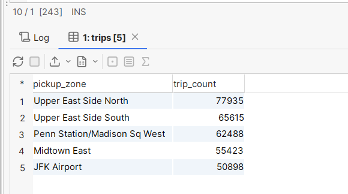
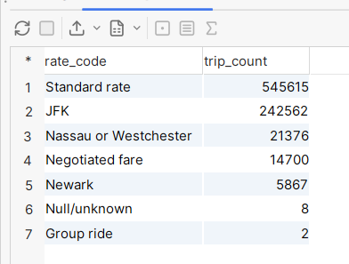
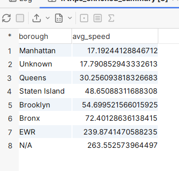
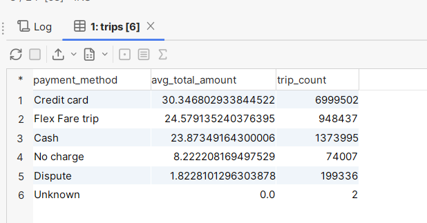
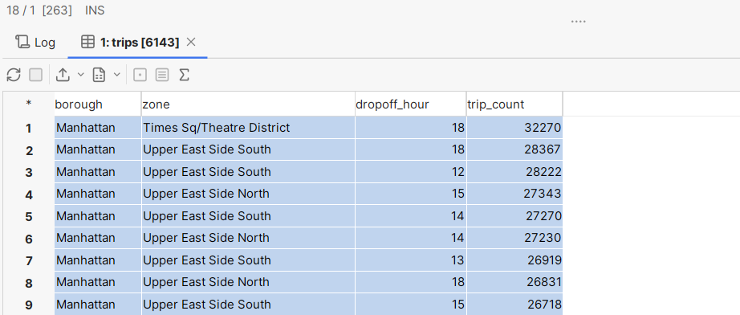

## Analytical Questions & Business Insights

This section outlines key SQL-driven insights that can be extracted from the NYC Taxi Trips data model using joins across all 5 tables: `trips`, `vendors`, `rate_codes`, `payment_types`, and `locations`. These insights are designed to support decision-making for city transport authorities and taxi regulation bodies.

---

### 🔍 Insight 1: Top 5 Busiest Pickup Zones During Rush Hours

**Business Value**: Understand morning demand patterns to improve dispatching, dynamic pricing, and congestion handling.

```sql
SELECT 
    l.zone AS pickup_zone,
    COUNT(*) AS trip_count
FROM trips t
JOIN taxi_zones l ON t.pu_location_id = l.locationid
WHERE EXTRACT(HOUR FROM t.tpep_pickup_datetime) BETWEEN 7 AND 10
GROUP BY l.zone
ORDER BY trip_count DESC
LIMIT 5;
```
Result:



### 🔍 Insight 2: Common Rate Codes Used for Airport Trips

**Business Value**: Analyze flat-rate code usage to detect compliance with airport fare regulations

```sql
SELECT 
    r.description AS rate_code,
    COUNT(*) AS trip_count
FROM trips t
JOIN rate_codes r ON t.rate_code_id = r.rate_code_id
WHERE t.airport_fee > 0
GROUP BY r.description
ORDER BY trip_count DESC;

```
Result:



### 🔍 Insight 3:Boroughs with the Slowest Average Speed

**Business Value**:Detect traffic-heavy zones that may need road or route policy intervention.

```sql
SELECT 
    l.borough,
    (AVG(te.average_speed_mph)) AS avg_speed
FROM trips_enriched_summary te
JOIN trips t ON te.trip_id = t.trip_id
JOIN taxi_zones l ON t.pu_location_id = l.locationid
WHERE te.average_speed_mph IS NOT NULL
GROUP BY l.borough
ORDER BY avg_speed ASC;
```

Result:



### 🔍 Insight 4: Average Total Fare per Payment Method

**Business Value**: Compare how payment behavior correlates with spending to understand digital vs cash spending habits.

```sql
SELECT 
    p.description AS payment_method,
    AVG(t.total_amount) AS avg_total_amount,
    COUNT(*) AS trip_count
FROM trips t
JOIN payment_types p ON t.payment_type_id = p.payment_type_id
GROUP BY p.description
ORDER BY avg_total_amount DESC;

```

Result:



### 🔍 Traffic Regulation Query:

```sql
SELECT
  l.borough,
  l.zone,
  EXTRACT(HOUR FROM t.tpep_dropoff_datetime) AS dropoff_hour,
  COUNT(*) AS trip_count
FROM
  trips t
JOIN
  taxi_zones l
ON
  t.do_location_id = l.locationid
GROUP BY
  l.borough,
  l.zone,
  dropoff_hour
ORDER BY
  trip_count DESC
```
Result:

